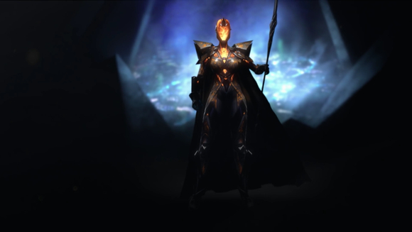
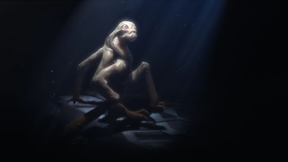
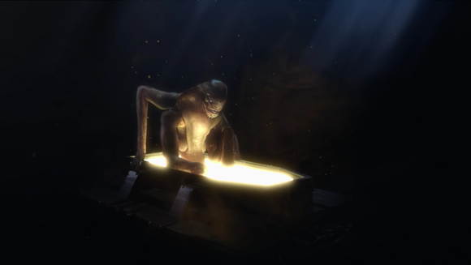

 

沃代阿尼（Vodyani） 是游戏[《Endless Space 2》](https://www.endless-space.com)中的一个派系。

Vodyani 常翻译做沃代阿尼，而在语境中也的确如此发音。但是 Vodyani 同时可以指乌克兰语/俄罗斯语中的 водяні，与水有关的前缀词。在乌克兰语中 водяні 发作沃顿涅，俄罗斯语中发作沃基涅。

沃代阿尼也有可能指斯拉夫民俗故事中的水怪 Vodyanoy。

沃代阿尼在游戏中的设定是过度工业化的受害者，因为从虚拟无尽的遗迹中找到技术而获救。

 
