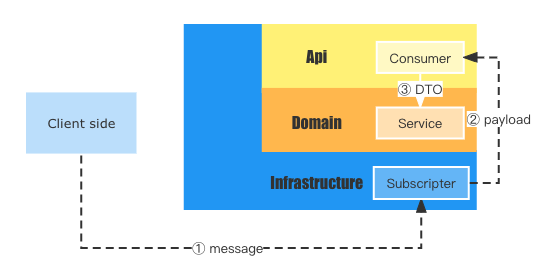

:::info
Consumer 消费者是 Vodyani 服务中的订阅消息承接者。Consumer 本质上是一个订阅 Infrastructure 层消息队列模块的提供者。
:::



消费者的目的是订阅并接收应用的特定消息。

消费者可以根据 Infrastructure 层消息队列模块提供的功能执行不同的操作。

:::danger 为什么要这么设计？
Vodyani 设计的初衷旨在打造一个跨平台的脚手架实践，并不会像 Nest.js 一样只暴露 Kafka 作为顶层消费者，而是将对于订阅/消费的顶层订阅处理机制解耦到 Infrastructure 层，开发者可以自由地选择如 RocketMQ/RabbitMQ/Kafka/Redis 这样的消息中间件。
:::

```typescript
import { Injectable } from '@nestjs/common';
import { FixedContext } from '@vodyani/core';

@Injectable()
export class DemoConsumer {

  @FixedContext
  private async subscribe() {
    //
  }
}
```