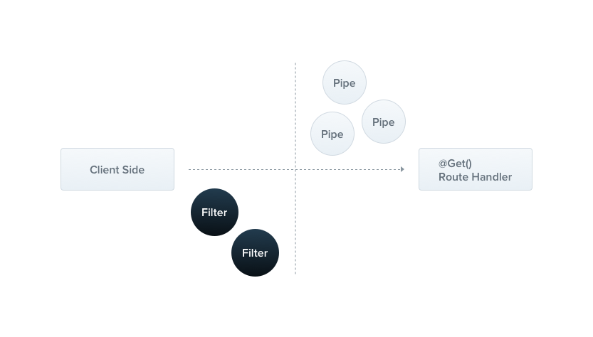

:::info
异常过滤器是 Vodyani 应用接口层 AOP 切面提供者的一部分，Filter 的概念继承自 Nest.js。
:::



## 内置异常过滤器

内置的异常层负责处理整个应用程序中的所有抛出的异常。当捕获到未处理的异常时，最终用户将收到友好的响应。

开发者无需单独处理该过滤器处理类型 HttpException（及其子类）的异常，每个发生的异常都由全局异常过滤器处理，当这个异常无法被识别时 (既不是 HttpException 也不是继承的类 HttpException)，用户将收到以下 JSON 响应:

```json
{
    "statusCode": 500,
    "message": "Internal server error"
}
```

### 继承内置异常过滤器

如果希望重用已经实现的核心异常过滤器，并基于某些因素重写行为，请看下面的例子。

为了将异常处理委托给基础过滤器，需要继承 `BaseExceptionFilter` 并调用继承的 `catch()` 方法。

```typescript
import { Catch, ArgumentsHost } from '@nestjs/common';
import { BaseExceptionFilter } from '@nestjs/core';

@Catch()
export class AllExceptionsFilter extends BaseExceptionFilter {
  catch(exception: unknown, host: ArgumentsHost) {
    super.catch(exception, host);
  }
}
```

:::danger 注意
继承自基础类的过滤器必须在 `app.container.ts` 或 `app.launcher.ts` 文件中声明。
:::


## 自定义异常过滤器

让我们创建一个异常过滤器，它负责捕获作为 `HttpException` 类实例的异常，并为它们设置自定义响应逻辑。

为此，我们需要访问 Express `Request` 和 `Response` 。我们将访问 `Request` 对象，以便提取原始 url 并将其包含在日志信息中。

我们将使用 `Response.json()` 方法，使用 `Response` 对象直接控制发送的响应。

:::tip
1. 所有异常过滤器都应该实现通用的 `ExceptionFilter<T>` 接口。它需要你使用有效签名提供 `catch(exception: T, host: ArgumentsHost)` 方法。`T` 表示异常的类型。

2. `@Catch()` 装饰器绑定所需的元数据到异常过滤器上。它告诉 Nest.js 这个特定的过滤器正在寻找 `HttpException` 而不是其他的。在实践中，`@Catch()` 可以传递多个参数，所以你可以通过逗号分隔来为多个类型的异常设置过滤器。
:::

```typescript
import { ExceptionFilter, Catch, ArgumentsHost, HttpException } from '@nestjs/common';
import { Request, Response } from 'express';

@Catch(HttpException)
export class HttpExceptionFilter implements ExceptionFilter {
  catch(exception: HttpException, host: ArgumentsHost) {
    const ctx = host.switchToHttp();
    const response = ctx.getResponse<Response>();
    const request = ctx.getRequest<Request>();
    const status = exception.getStatus();

    response
      .status(status)
      .json({
        statusCode: status,
        timestamp: new Date().toISOString(),
        path: request.url,
      });
  }
}
```

### 捕捉全部异常

为了捕获每一个未处理的异常(不管异常类型如何)，将 `@Catch()` 装饰器的参数列表设为空，例如 `@Catch()`。

## 公共异常类

Nest.js 提供了一个内置的 `HttpException` 类，它从 `@nestjs/common` 包中导入。

对于典型的基于 `HTTP Restful` 的应用程序，最佳实践是在发生某些错误情况时发送标准 HTTP 响应对象。

```typescript
@Get()
async findAll() {
  throw new HttpException('Forbidden', HttpStatus.FORBIDDEN);
}
```

现在当客户端调用这个端点时，响应如下所示：

```typescript
{
    "statusCode": 403,
    "message": "Forbidden"
}
```

HttpException 构造函数有两个必要的参数来决定响应:

1. `response` 参数定义 JSON 响应体。它可以是 string 或 object，如下所述。
2. `status` 参数定义 [HTTP 状态代码](https://developer.mozilla.org/en-US/docs/Web/HTTP/Status)。

默认情况下，JSON 响应主体包含两个属性：

1. `statusCode` 默认为 status 参数中提供的 HTTP 状态代码。
2. `message` 基于状态的 HTTP 错误的简短描述。

## 自定义异常类

自定义异常继承自 HttpException 基类。使用这种方法，Nest.js 可以识别您的异常，并自动处理错误响应。

```typescript
export class ForbiddenException extends HttpException {
  constructor() {
    super('Forbidden', HttpStatus.FORBIDDEN);
  }
}
```

## 内置 HTTP 异常

为了减少样板代码，Nest 提供了一系列继承自核心异常 HttpException 的可用异常。所有这些都可以在 `@nestjs/common` 包中找到：

- BadRequestException
- UnauthorizedException
- NotFoundException
- ForbiddenException
- NotAcceptableException
- RequestTimeoutException
- ConflictException
- GoneException
- PayloadTooLargeException
- UnsupportedMediaTypeException
- UnprocessableException
- InternalServerErrorException
- NotImplementedException
- BadGatewayException
- ServiceUnavailableException
- GatewayTimeoutException
