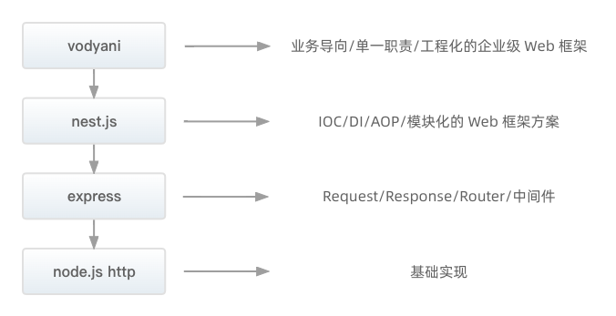

**Vodyani 是一个解决业务开发的 http 服务端脚手架。**

vodyani 基于 [nest.js](https://github.com/nestjs/nest) 开发，针对 node.js 服务端开发中的常见场景进行了易用的，友好的封装。

vodyani 的愿景是让 node.js 服务端开发者能够有一个基础的、拿来即用的脚手架。这个脚手架中将包含合理的层级设计、目录规范、编码规范（eslint）、单元测试等一系列工程化要素。

## 站在 nest.js 的肩膀上

近年来，node.js 作为前端和服务端的 “通用语言” 产生了很多影响巨大的框架，如 Angular，React 和 Vue，它们提高了开发人员的工作效率，并能够快速构建可测试和可扩展的前端应用程序。

服务端开发者可以使用 node.js 自带的 http 模块用来监听端口、处理请求响应，但是它的 api 过于原始，所以 express 的出现解决了 request、response 的 api 封装，以及提供了中间件来帮助开发者构建自己的洋葱模型。

然而，虽然 node.js 在服务端领域存在大量优秀的库工具，但它们都没有有效地解决主要问题 —— 架构。要解决架构问题，避免不了优秀的设计模式和框架约束。Egg.js、Midway.js、Nest.js 的出现也是这一结论的有效佐证。

在内部，nest.js 非常巧妙的结合了 TS 中的装饰器和反射机制，帮助我们将不同的类来自动注入到框架内部的 IoC 容器，把类的依赖，引用，初始化委托给了 nest.js 本身。这样我们就降低了一些隐形的维护成本，比如我们不需要关心以往面向过程式的调用关系。不需要传递复杂的请求上下文，极大程度地降低了代码结构的复杂度，减少了开发人员的心智负担。

在外层，nest.js 提供了基础的 module、controller、provider 作为顶层设计，并提供了丰富的模块来支持服务端应用开发。

但是 nest.js 做到的还远远不够：

1. nest.js 提供的（过滤器，拦截器，管道，守卫等）只能在 controller 中使用，provider 如果想加入切面机制只能通过开发者自己实现，如自定义装饰器、函数改造等。
2. 数据对象的传输，校验，转换如何处理？在 controller 中我们可以基于 pipe 和 interceptor 来进行处理，但在 provider 中呢？
3. 如何结合远程配置中心，使得配置中心的数据更新后，自动重建服务中的客户端（如 MySQL、Redis）？
4. 层级如何设计？模块如何划分？模块之间如何进行组织？这些问题其实才是留给使用者最大的挑战。

## vodyani 的强大功能

1. 在 nest.js 的基础上，针对层级和模块组织方式进行封装，并且提供了业务开发中一些常用的工具。
2. 基于 class-transformer + class-validator 进行封装，并提供易用的 class-decorator 模块，开发者可以使用对应的装饰器，对提供者提供 AOP 切面功能（转换、校验）。
3. 提供 ark 配置管理模块，你可以通过定义本地文件 + 定义远程配置中心引入的方式，轻松的管理，读取，写入全局配置。并且通过实现客户端适配器接口，开发者可以轻松的将客户端适配器注入到 ark 的动态数据源中进行动态部署。
4. 提供 DTO/DO/VO 三层数据。分别对应 `controller 请求输入`，`domain 处理中`，`controller 响应输出` 这三种数据处理状态。
 
## vodyani 的后续规划

1. Vodyani 的版本将始终跟随 nest.js 的 `major` 版本号进行迭代，除非 nest.js 不再进行维护。
