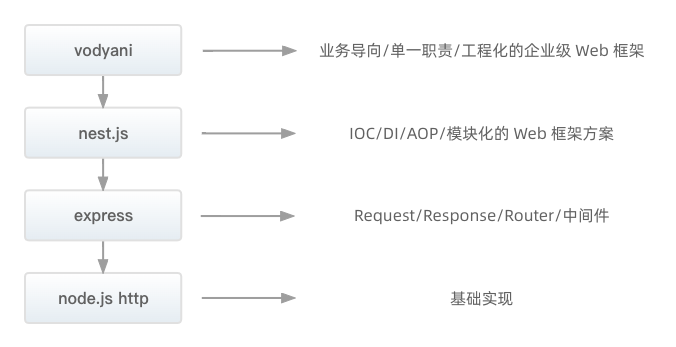

**vodyani 是一个企业级 web 框架 🥳**

vodyani 基于 [nest.js](https://github.com/nestjs/nest) 开发，针对 node.js 服务端开发中的常见场景进行了易用的，友好的封装。我们希望开发者可以通过 vodyani 解决工程化和业务开发中遇到的实际问题，从而显著地提升交付质量。

## 设计原则

早期的 node.js 开发者使用内置的 http 模块用来监听端口并处理请求响应，但是它的 api 过于原始，所以 express 的出现解决了 request、response 的 api 封装，以及提供了中间件来帮助开发者构建自己的洋葱模型。

诚然 node.js 存在大量优秀的库工具，但它们都没有有效地解决主要问题 —— 架构。要解决架构问题，避免不了优秀的设计模式和框架约束。egg.js、midway.js、nest.js 的出现也是这一结论的有效佐证。

在内部，nest.js 非常巧妙的结合了装饰器和反射机制，帮助我们将不同的类来自动注入到框架内部的 IOC 容器，把类的依赖，引用，初始化委托给了 nest.js 本身。这样我们就降低了一些隐形的维护成本，比如我们不需要关心以往面向过程式的调用关系。不需要传递复杂的请求上下文，极大程度地降低了代码结构的复杂度，减少了开发人员的心智负担。

在外层，nest.js 提供了基础的 module、controller、provider 作为顶层设计，并提供了丰富的模块来支持 web 应用开发。

**但是 nest.js 做到的还远远不够 🥺：**

* 我们需要定义项目的层级如何设计、模块如何划分、业务数据之间如何转换、模块之间如何进行组织。这些问题其实才是留给开发者最大的挑战。
* nest.js 提供的 AOP 机制（如过滤器，拦截器，管道，守卫等）最低的作用层级只能到 controller。
* nest.js 中没有提供基于装饰器实现 provider 层数据对象的传输，校验，转换的方案。
* nest.js 中的 config 模块功能过于基础，没有和远程配置中心结合使用的方案。
* nest.js 中各种 client 模块不支持配置更新后动态重建服务中的客户端（如 MySQL、Redis）。

综上所述，在实际业务的开发中我们需要比 nest.js 更加业务导向的企业级框架

## 特性介绍

**vodyani 在 nest.js 的基础上针对层级、代码、目录组织方式进行封装，并且提供了丰富的基础模块和工具 🤩**

* vodyani 根据项目业务的复杂度提供了两种架构模式，即 `MVC` 与 `DDD`。
* vodyani 根据业务数据的流向封装了 DTO/DO/VO。分别对应 请求数据输入，领域服务处理中，响应数据输出。
* vodyani 内置了易用的 class-decorator 装饰器工具模块，开发者通过声明对应的装饰器，就能在任意类中开启 AOP 功能。
* vodyani 内置了强大的 ark（方舟）配置管理模块，通过声明本地文件或引入配置中心的方式，就可以轻松的管理全局配置；并且支持各类 client provider 跟随配置变化进行进行动态重建。
* vodyani 提供了易用的 dust（星尘）多线程模块，通过引入模块并声明线程 worker 就可以体验多线程/线程池的强大威力。
 
## 版本介绍

* vodyani 的最低 `major` 版本为 `8.x`，对应 nest.js `8.x`。
* vodyani 的版本将始终跟随 nest.js 的 `major` 版本号进行迭代和改造，除非 nest.js 不再进行维护。
