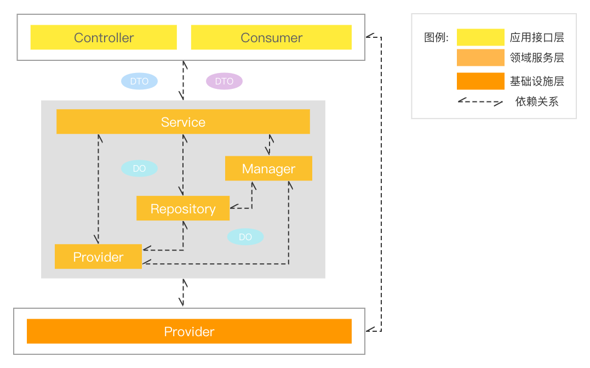

## 层级介绍
> Vodyani 的分层设计参考但未完全遵循 DDD 的分层模型和设计原则，整体分为以下四层：


### 应用接口层
> `Api` 是 DDD 分层模型中 `User Interface` 与 `Application` 的结合

* 负责向调用者返回信息或者解释用户发出的命令。
* 负责定义服务本身可以完成哪些任务，并向下协调 Domain/Infrastructure 层来解决问题。

### 领域服务层
> `Domain` 对应 DDD 中的领域服务层

* 负责实现业务逻辑，表达业务概念，处理业务状态信息和业务规则，此层是整个项目的重点。

### 基础设施层
> `Infrastructure` 对应 DDD 中的基础设施层

* 负责向其他层提供通用的技术能力，譬如配置、持久化能力、远程服务通讯等等。

### 公共约定层
> `Core` 是整个服务的公共约定层

* 负责提供通用方法、基础定义、工具集等等。

## 层级结构



## 目录结构

```bash
.
├── logs                    服务日志目录
├── public                  静态资源目录（多用于存放静态资源）
├── resource                应用资源目录（多用于存放配置信息）
├── src                     
│   ├── api                 应用接口目录
│   ├── core                核心定义目录
│   ├── domain              领域服务目录
│   ├── infrastructure      基础设施目录
│   ├── app.alias.ts        应用别名约定文件
│   ├── app.container.ts    应用模块容器
│   ├── app.bootstrap.ts    应用构建器
│   └── main.ts             应用启动目录
├── temp                    临时文件目录
└── test                    单元测试目录
```
