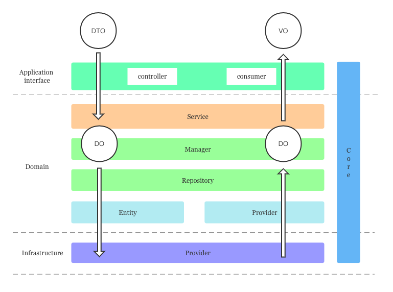

## 层级结构
> Vodyani 的分层设计参考但未完全遵循 DDD 的分层模型和设计原则，整体分为以下四层：


### 应用接口层
> `Api` 是 DDD 分层模型中 `User Interface` 与 `Application` 的结合

1. 负责向用户显示信息或者解释用户发出的命令。
2. 负责定义服务本身对外暴露的能力，即服务本身可以完成哪些任务，并负责协调 Domain Service 来解决问题。

### 领域服务层
> `Domain` 对应 DDD 中的领域服务层

负责实现业务逻辑，即表达业务概念，处理业务状态信息以及业务规则这些行为，此层是整个项目的重点。

### 基础设施层
> `Infrastructure` 对应 DDD 中的基础设施层

负责向其他层提供通用的技术能力，譬如持久化能力、远程服务通讯、工具集，等等。

### 公共约定层
> `Core` 是整个服务的公共约定层

负责提供通用方法、基础定义、全局切面提供者（AOP）。

## 层级调用关系



1. 由 Api 接收 DTO，并向 Domain 传输。
2. 由 Domain Service 接收 Api 传输的 DTO，并继续向下传输。
3. 由 Domain Repository 接收 Service 传输的 DTO 转化为 DO 并继续向下传输。
4. 由 Infrastructure 接收 Domain 传输的 DO，并进行处理和返回结果。
5. 由 Domain Repository 接收 Infrastructure 传输的数据，转化为 DO 并继续向上返回。
6. 由 Domain Service 接收 Repository 传输的 DO 转化为 VO 并继续向上返回。
7. 由 Api 接收 VO，并返回给调用方。

## 整体目录结构

```bash
.
├── logs                    临时日志目录
├── public                  静态资源目录
├── resource                服务资源目录
├── src                     服务应用目录
│   ├── api                 服务接口目录
│   ├── core                服务公共约定目录
│   ├── domain              服务领域服务目录
│   ├── infrastructure      服务基础设施目录
│   ├── app.alias.ts        服务别名约定文件
│   ├── app.container.ts    服务全局模块容器
│   ├── app.launcher.ts     服务构建器
│   └── main.ts             服务启动目录
├── temp                    临时文件目录
└── test                    单元测试目录
```
