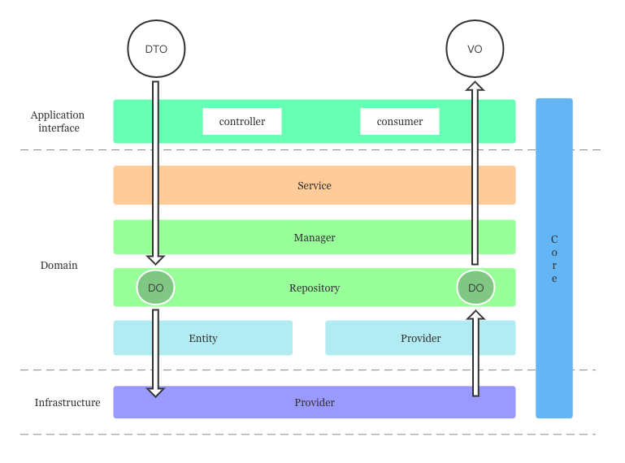

## 目录结构

- `test`                   单元测试目录
- `temp`                   临时文件目录
- `logs`                   临时日志目录
- `public`                 静态资源目录
- `resource`               服务资源目录
- `src`                    服务应用目录
  - `api`                  应用接口目录
  - `core`                 应用通用约定目录
  - `domain`               应用领域服务目录
  - `infrastructure`       应用基础设施目录
  - `app.alias.ts`         应用别名约定文件
  - `app.container.ts`     应用 IOC 容器模块文件
  - `app.launcher.ts`      应用启动器文件
  - `main.ts`              应用启动文件

## 分层结构
> Vodyani 的分层设计参考但未完全遵循 DDD 的分层模型和设计原则，整体分为以下四层：

### 应用接口层
> `Api` 是 DDD 分层模型中 `User Interface` 与 `Application` 的结合

1. 负责向用户显示信息或者解释用户发出的命令。
2. 负责定义服务本身对外暴露的能力，即服务本身可以完成哪些任务，并负责协调 Domain Service 来解决问题。

### 领域服务层
> `Domain` 对应 DDD 中的领域服务层

负责实现业务逻辑，即表达业务概念，处理业务状态信息以及业务规则这些行为，此层是整个项目的重点。

### 基础设施层
> `Infrastructure` 对应 DDD 中的基础设施层

负责向其他层提供通用的技术能力，譬如持久化能力、远程服务通讯、工具集，等等。

### 通用约定层
> `Core` 是整个服务的公共约定层

负责提供通用方法、基础定义、全局切面提供者（AOP）。

## 模块结构

### 模块内的通用约定

- `base`        模块公共类
- `module`      模块容器
- `method`      模块函数方法
- `common`      模块公共
  - `abstract`  抽象类声明
  - `constant`  常量声明
  - `declare`   依赖声明
  - `enum`      常量声明
  - `interface` 接口声明
  - `type`      类型声明

### 应用接口模块

- `controller`  HTTP 路由控制器
- `consumer`    消费者（需要接入消息队列/Redis 或者其他消费中间件）
- `dto`         数据传输对象
- `vo`          数据返回对象
- `filter`      AOP 异常过滤器
- `decorator`   AOP 装饰器
- `guard`       AOP 守卫
- `interceptor` AOP 拦截器
- `pipe`        AOP 管道
- `...`         应用接口内的通用约定

### 领域服务模块

- `service`    领域服务协调者
- `manager`    领域服务管理者
- `repository` 领域服务聚合根
- `entity`     领域服务实体
- `provider`   领域服务提供者（需要接入其他基础层提供者）
- `do`         领域对象
- `...`        应用接口内的通用约定

### 基础设施模块

- `provider`   基础设施提供者
- `...`        基础设施内的通用约定

### 通用约定层

- `filter`      全局 AOP 异常过滤器
- `decorator`   全局 AOP 装饰器
- `guard`       全局 AOP 守卫
- `interceptor` 全局 AOP 拦截器
- `pipe`        全局 AOP 管道
- `...`         全局的通用约定
