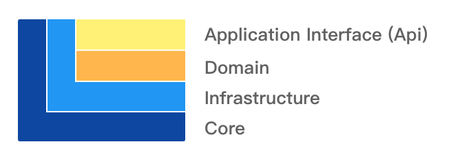

> Voydani 单体架构后端参考（并未完全遵循）了 DDD 的分层模式和设计原则，整体分为以下四层：

### Application Interface (Api)

1. 负责向用户显示信息或者解释用户发出的命令。请注意，这里指的“用户”不一定是使用用户界面的人，可以是位于另一个进程或计算机的服务。

2. 负责定义软件本身对外暴露的能力，即软件本身可以完成哪些任务，并负责对内协调领域对象来解决问题。根据 DDD 的原则，应用层要尽量简单，不包含任何业务规则或者知识，而只为下一层中的领域对象协调任务，分配工作，使它们互相协作，这一点在代码上表现为 Application 层中一般不会存在任何的条件判断语句。

### Domain

对应 DDD 中的 Domain 层，负责实现业务逻辑，即表达业务概念，处理业务状态信息以及业务规则这些行为，此层是整个项目的重点。

### Infrastructure

Infrastructure：对应 DDD 中的 Infrastructure 层，向其他层提供通用的技术能力，譬如持久化能力、远程服务通讯、工具集，等等。

